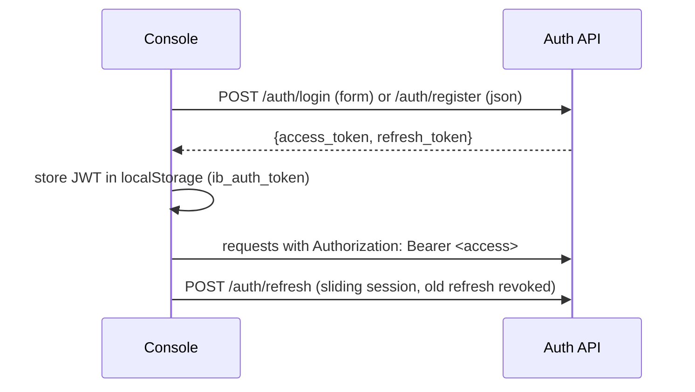

# Authentication and Authorization

JWT-based auth (PyJWT, HS256) with access + refresh tokens and bcrypt password
hashing.

## Flow

## Surface

| Endpoint | Body | Notes |
|----------|------|-------|
| `POST /auth/login` | form (username=email, password) | OAuth2 password grant shape |
| `POST /auth/register` | json (email, password>=8, full_name?) | 201 or 409 duplicate; self-service |
| `POST /auth/refresh` | json (refresh_token) | rotates tokens |
| `POST /auth/logout` | json (refresh_token?) | revokes jti; never raises |
| `GET /auth/me` | — | current user |

Passwords hashed with `passlib[bcrypt]`; `bcrypt` is pinned `<4.1.0` because
passlib 1.7.4 introspects a version attribute bcrypt 4.1 removed (fix logged in
[[Troubleshooting (Industrial Brain)]]).

## Route Guard

The [[Frontend Architecture|console]] wraps protected routes in `RequireAuth`;
no JWT redirects to `/login`. The chat WebSocket authenticates by passing the
token as a query param.

> [!gap] RBAC role hydration is a documented TODO: all users currently resolve
> to a `public` scope. Role-scoped retrieval exists as a parameter
> (`role_scope`) but is not yet populated per user. See [[Future Roadmap]].

## Sources

- [[Industrial Brain OS Repository]] — `backend/app/{domain,application,infrastructure}/auth/`
