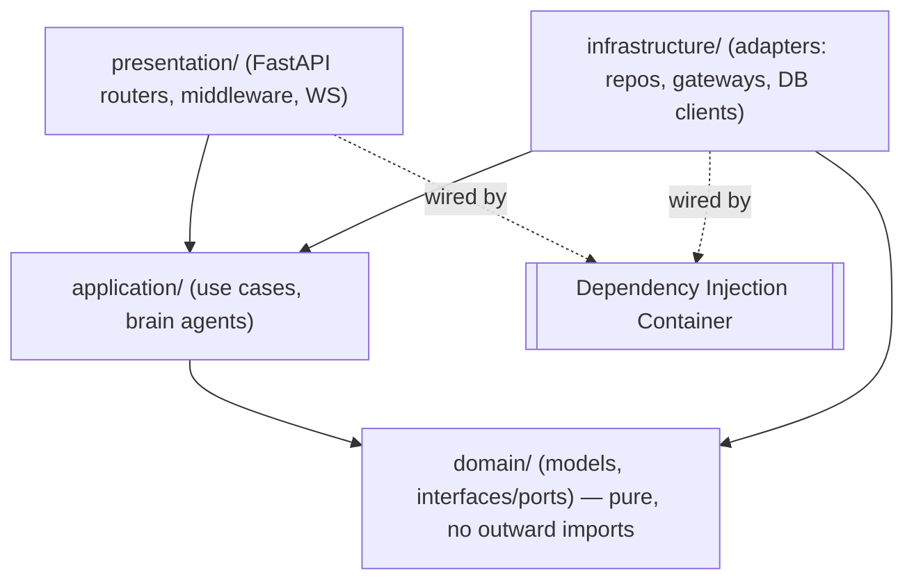

# Backend Architecture

The backend is a [[FastAPI]] application built on strict [[Clean Architecture]]
(ADR-013) and [[Domain-Driven Design]] (ADR-014). Four layers, dependencies
point inward only, and the rule is enforced in CI by `tests/test_architecture.py`.

## Layers

| Layer | Path | Responsibility | Depends on |
|-------|------|----------------|-----------|
| Domain | `app/domain/` | Entities, value objects, port interfaces. Pure Python. | nothing outward |
| Application | `app/application/` | Use cases, brain agents, orchestration | domain |
| Infrastructure | `app/infrastructure/` | Adapters: Postgres/Neo4j/Qdrant/Redis/MinIO clients, LLM gateways, Celery, config | domain (implements ports) |
| Presentation | `app/presentation/` | FastAPI routers (`api/v1`), middleware (logging, metrics, correlation id), error handlers | application |

> [!key-insight] The domain layer never imports outward (ADR-013). Every
> external system is reached through an interface defined in `domain/*/interfaces.py`
> and implemented in `infrastructure/`. This is what makes the brains and use
> cases unit-testable with plain fakes (see [[Testing Strategy]]).

## Composition Root

The [[Dependency Injection Container]] (`infrastructure/di/container.py`) is the
single composition root. It lazily constructs and caches every adapter, use
case, and brain agent, wiring ports to implementations. `main.py` reads only the
container; nothing else news up its own dependencies.

## Entry Point

`app/main.py` sets up logging, runs a `lifespan` that verifies DB connectivity
and initialises infrastructure (Qdrant collections, Neo4j constraints, MinIO
buckets), mounts CORS + [[Observability]] middleware, mounts `/metrics`, and
includes the `api/v1` router. See [[Ingestion Pipeline]] for the worker note in
that lifespan.

## Related

- Config: `infrastructure/config/settings.py` (Pydantic Settings, env-driven).
- Cross-cutting: [[Authentication and Authorization]], [[Observability]],
  [[PromptOps]].
- Downstream data: [[Data Layer]].

## Sources

- [[Industrial Brain OS Repository]] — `backend/app/`
