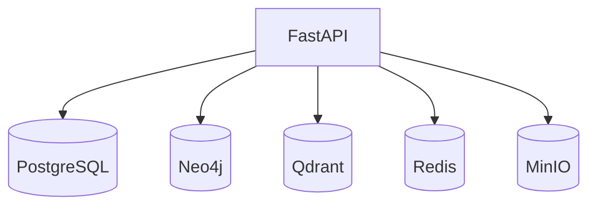

# Data Layer

Five datastores, each chosen for one job (polyglot persistence). All run as
Docker Compose services and are health-checked at API startup
([[Backend Architecture]] lifespan).

| Store | Role | Note | ADR |
|-------|------|------|-----|
| PostgreSQL | relational: users, documents, jobs, chunks, BM25 index | [[PostgreSQL]] | ADR-003 |
| Neo4j | the industrial [[Knowledge Graph]] | [[Neo4j]] | ADR-004 |
| Qdrant | vector store for chunk embeddings (1024-d) | [[Qdrant]] | ADR-005 |
| Redis | cache + [[Celery]] broker/result backend + session/live state | [[Redis]] | ADR-015 |
| MinIO | S3-compatible object store for raw uploaded files | [[MinIO]] | ADR-006 |

## Access Discipline

Every store is reached only through a domain **port** implemented in
`infrastructure/`; use cases and brains never touch a driver directly
([[Clean Architecture]]). Schema/collections/buckets are created idempotently by
`scripts/init_infra.py` and the startup `lifespan`. Postgres schema is migrated
with Alembic (`make db-migrate`).

## Health

`GET /api/v1/health` reports each store. Note: Qdrant and MinIO can show
"unhealthy" in `docker ps` due to strict container healthchecks while still
serving correctly; the app-level health check is authoritative.

## Sources

- [[Industrial Brain OS Repository]] — `backend/app/infrastructure/`, `docker-compose.yml`
