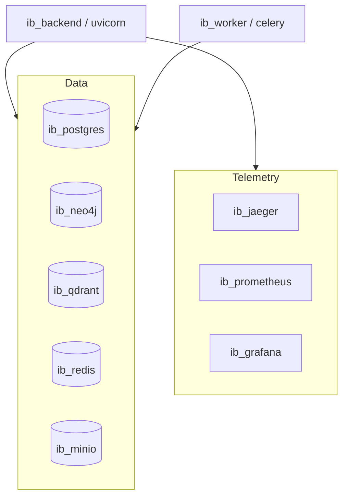

# Deployment

The platform runs as a [[Docker]] Compose stack plus three application processes.

## Compose Services

## Local Dev (three processes)

`make dev` documents the three terminals required:

1. Backend: `uvicorn app.main:app --reload`
2. Worker: `python scripts/run_worker.py` (REQUIRED for ingestion, see
   [[Ingestion Pipeline]])
3. Frontend: `pnpm dev`

Infra first: `make up` (compose), then `make db-migrate` and
`python scripts/init_infra.py`.

> [!key-insight] The worker is a first-class process, not optional. In
> production the `ib_worker` container runs it; locally it must be started by
> hand. Forgetting it is the top cause of "uploads stuck in QUEUED" (see
> [[Troubleshooting (Industrial Brain)]]).

## Reset

- Soft: `make db-reset`.
- Hard: `docker compose down -v && docker compose up -d`, re-migrate, re-init.

## Sources

- [[Industrial Brain OS Repository]] — `docker-compose.yml`, `Makefile`, `docs/manual/DEPLOYMENT.md`
