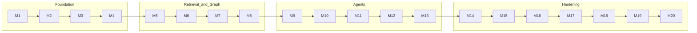

# Development Timeline

The M1-M20 build history (`docs/implementation_roadmap.md`). One milestone per
session, verified before commit. Each milestone has a walkthrough, verification,
and summary under `docs/`.

| # | Milestone | What shipped | Notes |
|---|-----------|--------------|-------|
| M1 | Infrastructure Validation & DB Init | Docker stack, DB clients, DI container | [[Data Layer]], [[Dependency Injection Container]] |
| M2 | Document Ingestion Pipeline | upload -> MinIO -> job -> chunk | [[Ingestion Pipeline]] |
| M3 | OCR & Layout-Aware Parsing | PyMuPDF + PaddleOCR + layout | [[Document Parsing and OCR]] |
| M4 | Embedding Pipeline & Qdrant | bge-large embeddings -> Qdrant + BM25 | [[Qdrant]] |
| M5 | Basic Chat API & Copilot UI | WebSocket chat + React console | [[Frontend Architecture]] |
| M6 | Industrial Ontology & Neo4j Init | ontology schema, constraints | [[Industrial Ontology]] |
| M7 | Entity & Relation Extraction | spaCy NER + LLM relations -> Neo4j | [[Entity and Relation Extraction]] |
| M8 | GraphRAG Engine (stages 1-6) | hybrid retrieval + rerank | [[GraphRAG Pipeline]] |
| M9 | Knowledge Brain (LangGraph) | grounded copilot agent | [[Knowledge Brain]] |
| M10 | Maintenance Brain | maintenance agent | [[Maintenance Brain]] |
| M11 | Compliance Brain | gap-detection agent | [[Compliance Brain]] |
| M12 | RCA Brain | 5-Whys / Ishikawa agent | [[Root Cause Analysis Brain]] |
| M13 | Lessons Learned Brain | pattern-mining agent | [[Lessons Learned Brain]] |
| M14 | Full 8-Stage Pipeline (7-8) | compression + citation validation | [[Context Compression]], [[Citation Validation]] |
| M15 | Event-Driven Ingestion | Celery + Redis async chain | [[Event-Driven Ingestion]] |
| M16 | Evaluation Layer | golden set + hallucination gate | [[Evaluation Layer]] |
| M17 | Observability Stack | OTel + Prometheus + Grafana | [[Observability]] |
| M18 | PromptOps Finalization | schema-validated prompts | [[PromptOps]] |
| M19 | UI Polish, KG Visualizer, Demo Data | Cytoscape graph, demo corpus | [[Knowledge Graph]] |
| M20 | Perf Hardening, Security Audit | benchmarks, bandit/pip-audit | [[Testing Strategy]] |

> [!key-insight] The order is deliberate: data plumbing (M1-M4), retrieval and
> graph (M5-M8), agents (M9-M13), then production hardening (M14-M20). Each layer
> is only built once the one beneath it is verified.

## Post-M20 Work (this vault's session)

- Self-service signup + login route guard; bcrypt compatibility pin.
- [[E2E Validation Suite]] (Playwright + Chrome, 31 tests).
- Local ingestion worker made runnable (`scripts/run_worker.py`), see
  [[Troubleshooting (Industrial Brain)]].

## Sources

- [[Industrial Brain OS Repository]] — `docs/implementation_roadmap.md`
