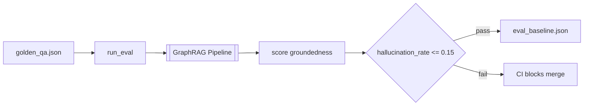

# Evaluation Layer

A quantitative quality gate over the [[GraphRAG Pipeline]] (M16). It runs a
golden question-answer set through the retrieval + generation path and scores
groundedness, so regressions are caught before merge.

## Mechanism

- **Golden dataset**: `datasets/golden_qa.json` — domain-expert questions with
  expected evidence (built around the P-102A demo corpus, e.g. rated discharge
  pressure, isolation procedure, failure modes).
- **Metrics**: `hallucination_rate`, `retrieval_recall`, `context_precision`,
  answer quality. Exposed as Prometheus gauges from boot ([[Observability]]).
- **Gate**: `hallucination_rate <= 0.15` ([[Hallucination Gate]]). CI fails the
  build if the baseline regresses.
- **Run**: `make eval` (`scripts/run_eval.py`) writes `docs/eval_baseline.json`.

> [!key-insight] Grounding is enforced twice: structurally by
> [[Citation Validation]] (drop unsupported citations) and statistically by this
> gate. Together they are the anti-hallucination story for [[Judge Q&A]].

## Related

- Depends on: a processed corpus (run the [[Ingestion Pipeline]] first).
- Reports to: [[Observability]] (`/metrics`).

## Sources

- [[Industrial Brain OS Repository]] — `scripts/run_eval.py`, `datasets/golden_qa.json`
