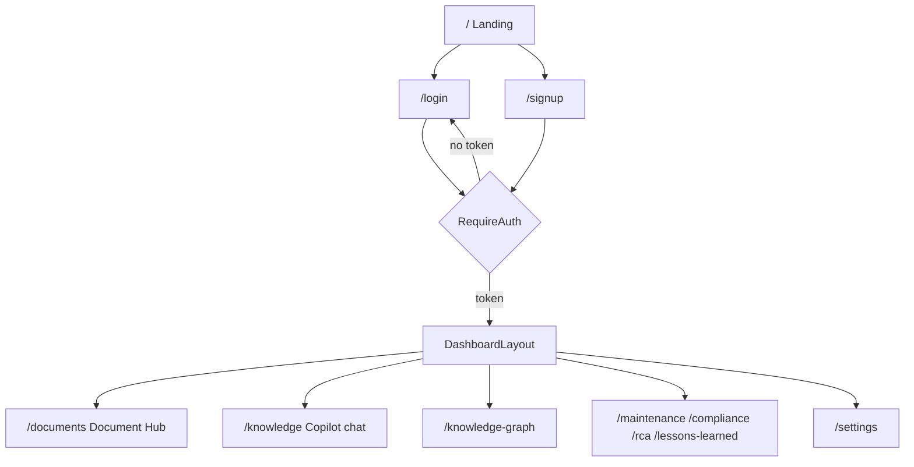

# Frontend Architecture

The operator console: [[React]] 18 + Vite 6 + TypeScript + Tailwind, with
`react-router-dom` v6, `framer-motion`, `cytoscape` (graph view), and `react-pdf`
(document viewer). Shipped in M5, polished in M19.

## Routes and Guards

`RequireAuth` is a pathless layout route: no JWT in `localStorage`
(`ib_auth_token`) redirects to `/login` (see [[Authentication and Authorization]]).

## Key Screens

| Screen | Component | Talks to |
|--------|-----------|----------|
| Document Hub | `DocumentHub` (Library + Upload tabs) | `/documents/*` REST, polls status |
| Knowledge Copilot | `ChatInterface` | WebSocket `/chat/stream` ([[GraphRAG Pipeline]]) |
| Knowledge Graph | `KnowledgeGraphView` (Cytoscape) | `/graph/subgraph` ([[Knowledge Graph]]) |
| Intelligence Brains | `SubBrainPanel` x4 | `/{brain}/status` |
| Settings | `SettingsPage` | theme only |

## Cross-cutting

- **Auth**: `AuthContext` stores the JWT in `localStorage`; chat WS passes it as
  a query param.
- **Theme**: light / dark / system, persisted to `ib-ui-theme`, applied as a
  class on `<html>`.
- **Dev proxy**: Vite proxies `/api` to `127.0.0.1:8000`; `server.fs.allow: ['..']`
  serves pnpm-hoisted workspace assets (fix logged in [[Troubleshooting (Industrial Brain)]]).
- **Validation**: exercised end-to-end by the [[E2E Validation Suite]].

> [!gap] The four specialist brains render as read-only status panels, not
> interactive chat, in the current UI. See [[Intelligence Brains]] and
> [[Future Roadmap]].

## Sources

- [[Industrial Brain OS Repository]] — `frontend/src/`
