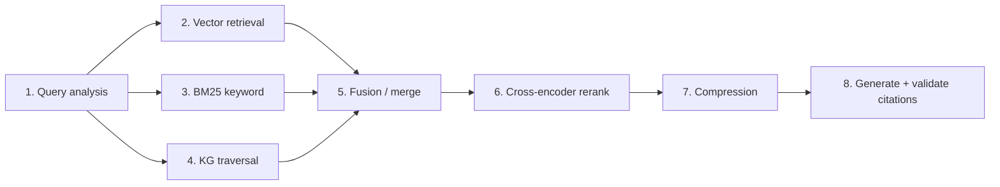

# GraphRAG Pipeline

The retrieval engine behind every [[Intelligence Brains|brain]]. It combines
vector search, keyword search, and [[Knowledge Graph]] traversal ([[Hybrid Retrieval]], ADR-008 / ADR-009), then reranks, compresses, and validates
citations before generation. Built as **8 stages**: stages 1-6 shipped in M8,
stages 7-8 in M14 (see [[Development Timeline]]).

## The 8 Stages

| # | Stage | Mechanism | Backed by |
|---|-------|-----------|-----------|
| 1 | Query analysis | normalise, expand the question | LLM / rules |
| 2 | Vector retrieval | semantic top-k over embeddings | [[Qdrant]], `bge-large-en-v1.5` (1024-d) |
| 3 | Keyword retrieval | BM25 lexical match | Postgres `bm25_index` ([[rank-bm25]]) |
| 4 | Graph traversal | bounded subgraph around matched entities | [[Neo4j]] |
| 5 | Fusion | merge + dedupe candidate chunks | application layer |
| 6 | Reranking | cross-encoder relevance re-scoring | `BAAI/bge-reranker-large` |
| 7 | Compression | drop low-signal tokens to fit context | [[LLMLingua]] (M14) |
| 8 | Generation + citations | answer + `[[chunk:id]]` -> [[Citation Validation]] | [[Ollama]] llama3.2 |

> [!key-insight] Vectors find *semantically similar* text, BM25 catches *exact
> tags* like `P-102A`, and the graph adds *related entities* the text never
> mentioned. Fusing all three is why answers are grounded even when the
> phrasing differs from the source.

## Grounding and Anti-Hallucination

Stage 8 only keeps citation markers (`[[chunk:<id>]]`) that resolve to chunks
actually retrieved; hallucinated references are dropped ([[Citation Validation]]).
The [[Evaluation Layer]] gates this quantitatively: `hallucination_rate <= 0.15`.

## Entry Points

- Serving path: `IGraphRAGEngine` (domain port) implemented in
  `infrastructure/graphrag/`, consumed by every brain via [[Base Brain Agent]].
- Chat transport: WebSocket `/api/v1/chat/stream` streams tokens then a `done`
  frame carrying `citations` and `token_usage` (see [[API Reference (Industrial Brain)]]).

## Related

- Compression detail: [[Context Compression]]
- Config knobs: `GRAPHRAG_RERANKER_MODEL`, `LLMLINGUA_MODEL`, `top_k`.
- Consumed by: [[Knowledge Brain]] and the four specialist brains.

## Sources

- [[Industrial Brain OS Repository]] — `backend/app/infrastructure/graphrag/`
