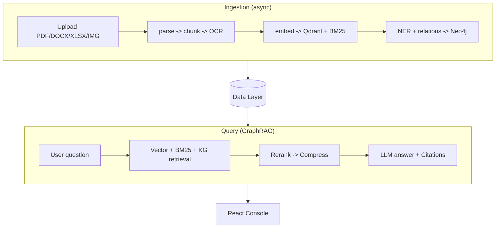

# Industrial Brain OS

Master Map of Content for the **Industrial Brain OS** project: a research-grade,
production-oriented AI platform that ingests heterogeneous industrial documents
(P&IDs, SOPs, manuals, maintenance records, inspection reports, work orders,
regulations) and turns them into a queryable **Asset & Operations Brain**. Built
for the Industrial Knowledge Intelligence hackathon (see [[Judge Q&A]]).

> [!key-insight] The product is a **hybrid GraphRAG** copilot over a live
> industrial [[Knowledge Graph]], plus five specialised [[Intelligence Brains]],
> all on a [[Clean Architecture]] backend.

## System at a Glance

## Core Subsystems

| Area | Note | Milestone(s) |
|------|------|--------------|
| Backend clean-architecture | [[Backend Architecture]] | M1, [[Clean Architecture]] |
| Frontend console | [[Frontend Architecture]] | M5, M19 |
| Retrieval engine | [[GraphRAG Pipeline]] | M8, M14 |
| Knowledge graph | [[Knowledge Graph]] | M6, M7 |
| Document ingestion | [[Ingestion Pipeline]] | M2, M3, M15 |
| Embeddings + vectors | [[Data Layer]], [[Qdrant]] | M4 |
| Agents | [[Intelligence Brains]] | M9-M13 |
| Prompt governance | [[PromptOps]] | M18 |
| Quality gate | [[Evaluation Layer]] | M16 |
| Telemetry | [[Observability]] | M17 |
| Security | [[Authentication and Authorization]] | M20 |
| Packaging | [[Deployment]] | M18, [[Docker]] |

## The Five Brains

[[Intelligence Brains]] is the agent layer. Each is a [[LangGraph]] state machine
built on the shared [[Base Brain Agent]]:

- [[Knowledge Brain]] — grounded engineering copilot (the default chat)
- [[Maintenance Brain]] — work orders, failure history, OEM procedures
- [[Compliance Brain]] — regulation-to-procedure gap detection
- [[Root Cause Analysis Brain]] — 5-Whys / Ishikawa investigations
- [[Lessons Learned Brain]] — incident and near-miss pattern mining

## Reference Notes

- [[Tech Stack]] — every technology and why ([[Decision Log (Industrial Brain)]])
- [[Development Timeline]] — the M1-M20 build history
- [[Design Patterns (Industrial Brain)]] — recurring engineering patterns
- [[Testing Strategy]] — 387 backend tests + E2E validation
- [[API Reference (Industrial Brain)]] — HTTP + WebSocket surface
- [[Troubleshooting (Industrial Brain)]] — common failure modes
- [[Future Roadmap]] — what is scaffolded vs shipped
- [[Judge Q&A]] — hackathon evaluation prep

## Project Constraints (from CLAUDE.md)

- Clean Architecture, SOLID, Domain-Driven Design; domain layer stays pure.
- One milestone per session; verify before committing.
- Architecture is authoritative and never redesigned (see [[Decision Log (Industrial Brain)]]).

## Sources

- [[Industrial Brain OS Repository]] — `D:\industrial-brain`, branch `feature/bootstrap`
