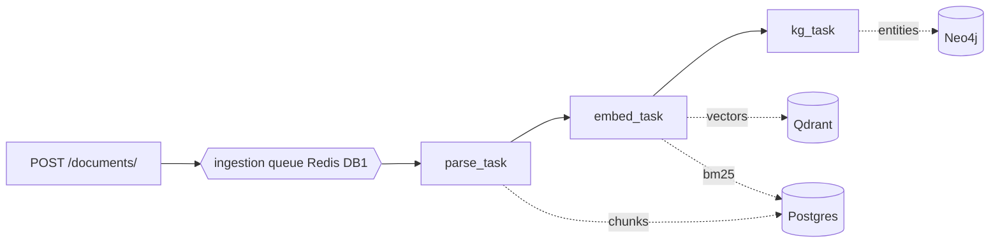

# Ingestion Pipeline

Turns an uploaded file into searchable, graph-linked knowledge. Runs
asynchronously as a [[Celery]] chain (ADR-015, [[Event-Driven Ingestion]], M15)
so the API stays responsive while heavy OCR / embedding / extraction happens on
a worker.

## The Chain

| Task | Reuses | Does | Status transitions |
|------|--------|------|--------------------|
| `parse_task` | `DocumentParsingUseCase` | extract text, [[Document Parsing and OCR|OCR]], layout parse, chunk | QUEUED -> EXTRACTING -> CHUNKED |
| `embed_task` | `EmbeddingUseCase` | embed chunks -> [[Qdrant]] + BM25 index | CHUNKED -> EMBEDDING -> INDEXED |
| `kg_task` | `ExtractionUseCase` | NER + relations -> [[Neo4j]] | INDEXED -> KG_EXTRACTING -> COMPLETED |

Document status runs `READY_FOR_PROCESSING -> PROCESSING -> PROCESSED` (or
`FAILED`). Each task retries 3x with exponential backoff (60/120/240s) before
marking the job `FAILED` with structured `error_details`.

## Two Backends (one port)

`INGESTION_BACKEND` selects the dispatcher (`infrastructure/di/container.py`):

- `celery` (default, ADR-015): dispatches the chain to a separate worker
  process. Requires a running worker.
- `redis-queue` (legacy, single-node): an in-process daemon thread consumes a
  Redis list inside the API. No separate process. Same parse/embed/kg use cases.

> [!key-insight] With the default `celery` backend, uploads stay `QUEUED`
> forever unless a worker is running. Start one with `python scripts/run_worker.py`
> (auto-resolves the backend venv; `--pool=solo` for Windows). In production the
> `ib_worker` container runs it. See [[Troubleshooting (Industrial Brain)]].

## Broker

[[Redis]] logical DB 1 is the Celery broker (queue name `ingestion`), DB 2 the
result backend. Correlation IDs from the upload request propagate into task
payloads so worker logs join the same trace ([[Observability]]).

## Related

- What feeds it: [[Frontend Architecture|Document Hub upload]] / `POST /documents/`.
- What it produces: searchable chunks for [[GraphRAG Pipeline]] and nodes for
  the [[Knowledge Graph]].
- Bulk seeding: `scripts/load_demo_data.py --docs --upload`.

## Sources

- [[Industrial Brain OS Repository]] — `backend/app/infrastructure/celery/`, `document/`
