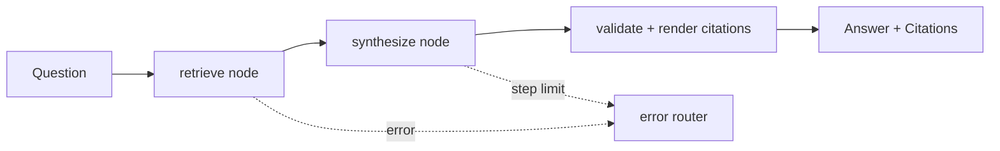

# Intelligence Brains

The agent layer (ADR-019, multi-brain architecture). Five specialised agents,
each a [[LangGraph]] `StateGraph` built on the shared [[Base Brain Agent]], each
grounded by the [[GraphRAG Pipeline]] and governed by [[PromptOps]] (M9-M13).

## The Five

| Brain | Note | Purpose | Milestone |
|-------|------|---------|-----------|
| Knowledge | [[Knowledge Brain]] | grounded engineering copilot (the default chat) | M9 |
| Maintenance | [[Maintenance Brain]] | work orders, failure history, OEM procedures | M10 |
| Compliance | [[Compliance Brain]] | regulation-to-procedure gap detection | M11 |
| Root Cause | [[Root Cause Analysis Brain]] | 5-Whys / Ishikawa investigations | M12 |
| Lessons Learned | [[Lessons Learned Brain]] | incident and near-miss pattern mining | M13 |

## Shared Shape

Every brain reuses the [[Base Brain Agent]] primitives: `load_prompt()`,
`format_context_blocks()`, `validate_chunk_citations()`, `render_citations()`,
a step-limit guard, and an error-router edge. Adding a brain follows a fixed
recipe (domain models, prompt + MANIFEST entry, tools, LangGraph agent, DI
factory, router). See [[Design Patterns (Industrial Brain)]].

> [!gap] All five agents are implemented, but the console currently exposes only
> the [[Knowledge Brain]] as interactive chat; Maintenance / Compliance / RCA /
> Lessons Learned render as live status panels (`/{brain}/status`, `scaffold: true`).
> Wiring one specialist to interactive chat is the top [[Future Roadmap]] item.

## Related

- Retrieval: [[GraphRAG Pipeline]]
- Prompts: [[PromptOps]]
- Model: [[Ollama]] (llama3.2), with a [[Gemini]] gateway available

## Sources

- [[Industrial Brain OS Repository]] — `backend/app/application/*_brain/`, `ai/agents/`
