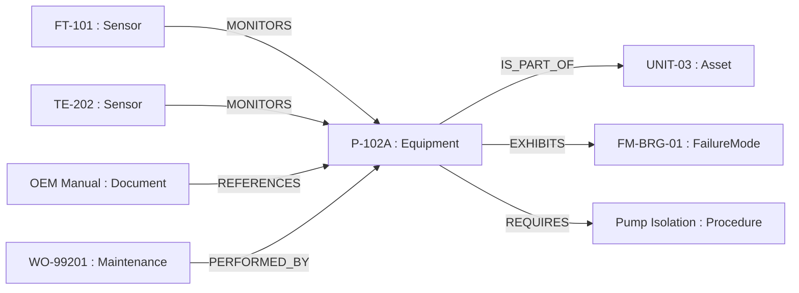

# Knowledge Graph

A [[Neo4j]] property graph that unifies entities across every ingested document:
equipment, assets, sensors, failure modes, procedures, regulations, and the
documents that mention them. It powers stage 4 of the [[GraphRAG Pipeline]] and
the interactive graph view in the [[Frontend Architecture|console]] (M6, M7, M19).

## Ontology

The graph is typed by the [[Industrial Ontology]] (`ontology/industrial_ontology.yaml`,
ADR-010): 12 node types and 19 allowed relations, validated at load and at write
time by the `OntologyValidatorService`.

Node types include `Asset`, `Equipment`, `Sensor`, `FailureMode`, `Procedure`,
`Document`, `Regulation`, `Maintenance`, `Inspection`, `Personnel`, `Process`,
`LessonLearned`. Uniqueness constraints exist on tag/code keys (e.g.
`tag_number` for equipment).

## How Entities Get In

The final stage of the [[Ingestion Pipeline]] (`kg_task`) runs
[[Entity and Relation Extraction]]: [[spaCy]] NER (`en_core_web_sm`) plus an
LLM relation-extraction prompt (governed by [[PromptOps]]), then idempotent
`MERGE` writes into Neo4j. Per-chunk failures are isolated so one bad chunk
never aborts the document.

## How It Is Queried

- **Traversal for retrieval**: bounded neighbourhood expansion around entities
  matched from the query ([[GraphRAG Pipeline]] stage 4).
- **Subgraph API**: `GET /api/v1/graph/subgraph?entity_tag=<tag>&depth=<1-3>`
  returns nodes + edges + stats for the [[Frontend Architecture|Cytoscape view]].
- **Demo seed**: `scripts/load_demo_data.py --graph-only` seeds a P-102A
  refining-unit subgraph (15 nodes, 15 relations) idempotently.

> [!gap] Traversal MATCHes on exact `tag_number`, not fuzzy match. A tag typed
> differently than stored returns an empty subgraph. See
> [[Troubleshooting (Industrial Brain)]].

## Sources

- [[Industrial Brain OS Repository]] — `backend/app/infrastructure/{graph,ontology,extraction}/`
