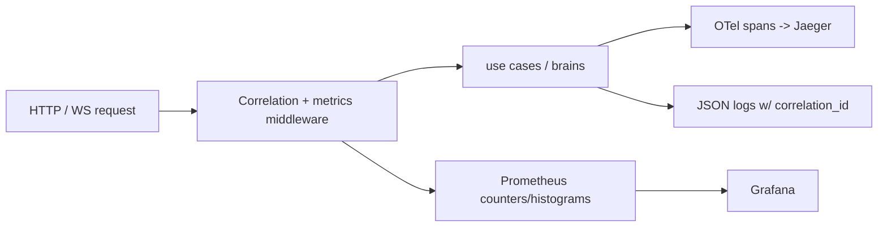

# Observability

Three-signal telemetry (M17): distributed traces, metrics, and structured logs,
correlated by a request-scoped correlation ID.

| Signal | Stack | ADR |
|--------|-------|-----|
| Traces | [[OpenTelemetry]] SDK -> Jaeger via OTLP/HTTP | ADR-016 |
| Metrics | Prometheus `/metrics` -> Grafana dashboards | ADR-017 |
| Logs | structured JSON (`structlog` / python-json-logger) | — |

## How It Ties Together

- **Correlation ID**: set by `LoggingAndCorrelationMiddleware`, carried through
  the [[Ingestion Pipeline]] into [[Celery]] task payloads so worker logs join
  the same trace.
- **Metrics**: HTTP rate/latency/errors, LLM calls, Celery task outcomes,
  WebSocket sessions, plus [[Evaluation Layer]] gauges. Created at boot so
  `/metrics` is populated from the first request.
- **Traces**: no-op unless `OTEL_ENABLED=true`; Jaeger UI on port 16686.

> [!key-insight] Every ingestion stage emits a span
> (`celery.parse_task` / `embed_task` / `kg_task`) tagged with the document and
> job id, so a stuck document can be traced to the exact failing stage. See
> [[Troubleshooting (Industrial Brain)]].

## Sources

- [[Industrial Brain OS Repository]] — `backend/app/infrastructure/observability/`
