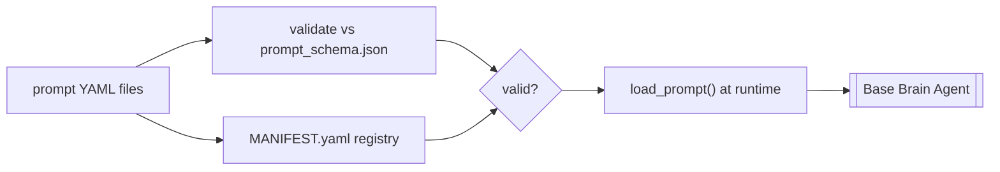

# PromptOps

Prompts are treated as versioned, schema-validated artifacts, not inline strings
(ADR-020, M18). Every brain prompt lives in a YAML file under
`backend/ai/prompts/`, is validated against a JSON Schema, and is registered in a
manifest.

## Mechanism

- **Schema**: `backend/ai/prompts/prompt_schema.json` requires fields like
  `prompt_id`, `version`, `description`, `owning_brain`, `output_format`,
  `system`, `user_template` (and `uncertain_template` for clarification
  fallbacks).
- **Manifest**: `backend/ai/prompts/MANIFEST.yaml` lists every shipped prompt;
  it must match what is on disk.
- **Validation gate**: `make validate-prompts` (`scripts/validate_prompts.py`)
  checks all prompts against schema + manifest. Enforced in CI.
- **Runtime**: `load_prompt()` (shared in [[Base Brain Agent]]) loads the right
  prompt for each brain; there is no hot-reload (restart to pick up edits).

> [!key-insight] Governing prompts as files makes them reviewable, diffable, and
> testable. `tests/test_prompts.py` validates every prompt and confirms the
> manifest matches disk, so a malformed or unregistered prompt fails the build.

## Related

- Consumers: every agent in [[Intelligence Brains]].
- Quality: prompt changes should be checked against the [[Evaluation Layer]].

## Sources

- [[Industrial Brain OS Repository]] — `backend/ai/prompts/`
